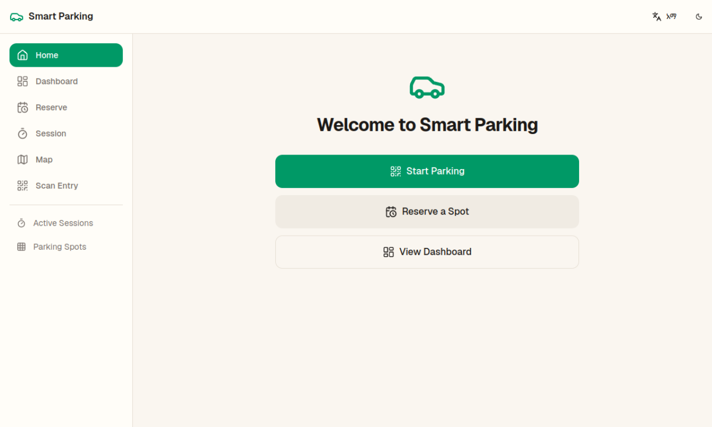
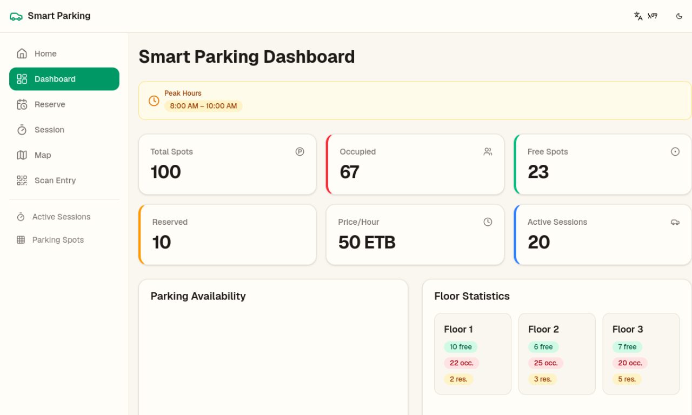
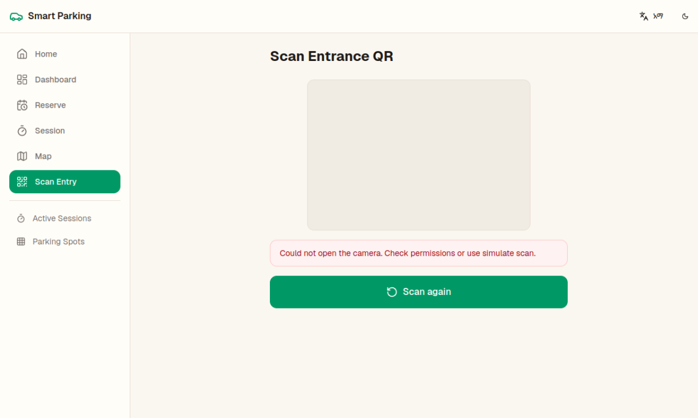
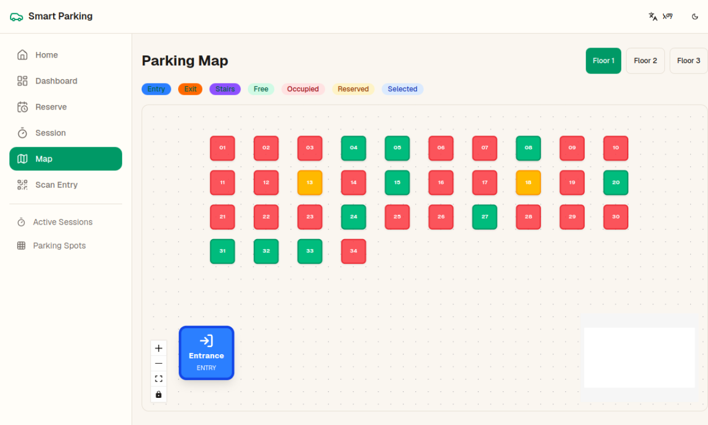
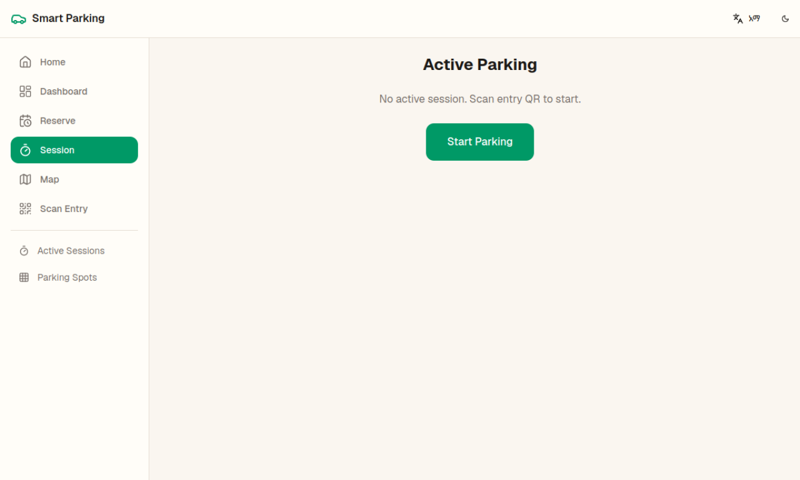
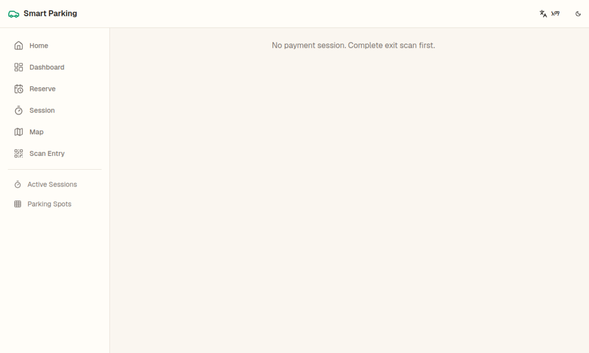
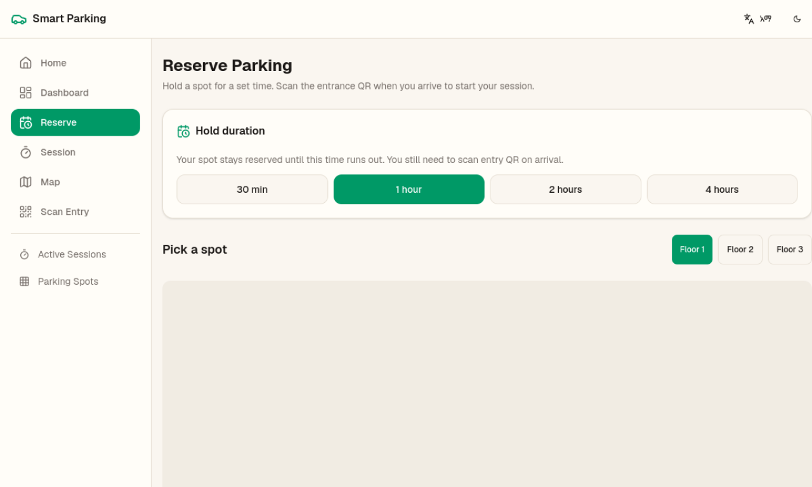

# Smart Parking System

A full-stack-style **smart parking demonstration** built with **Next.js 16**, **TypeScript**, and **Tailwind CSS v4**. The application simulates QR-based garage entry and exit, spot recommendations, multi-floor interactive maps, timed reservations, live navigation, session billing, and Ethiopian payment methods — with an **offline-first PWA** architecture powered by client-side state, services, and mock data (no external backend required for the demo).

---

## 🌐 Live Demo

- 🔗 **Production:** [https://parking-system-murex.vercel.app](https://parking-system-murex.vercel.app)
- 📱 **PWA:** Install from the browser menu on the live site (HTTPS required)

---

## 🧰 Tech Stack

### 🖥️ Frontend

| Layer | Technology |
|-------|------------|
| Framework | [Next.js 16](https://nextjs.org/) (App Router) |
| Language | [TypeScript](https://www.typescriptlang.org/) |
| Styling | [Tailwind CSS v4](https://tailwindcss.com/) |
| State | [Zustand](https://zustand.docs.pmnd.rs/) + `persist` |
| i18n | [next-intl](https://next-intl.dev/) (English & Amharic) |
| Theme | [next-themes](https://github.com/pacocoursey/next-themes) |
| Charts | [Recharts](https://recharts.org/) |
| Map | [@xyflow/react](https://reactflow.dev/) |
| QR | [html5-qrcode](https://github.com/mebjas/html5-qrcode) |
| PWA | [@serwist/next](https://serwist.pages.dev/) |
| Offline storage | [idb](https://github.com/jakearchibald/idb) (IndexedDB) |
| UI motion | [Framer Motion](https://www.framer.com/motion/) |
| Git hooks | Husky + lint-staged |

### 🗄️ Data layer (demo)

This repository is a **frontend demo**: business logic lives in `src/services/`, state in Zustand stores, and persistence via **localStorage** + **IndexedDB**. There is no separate Django/Node API server in this project.

---

## 📂 Project Structure

```
parking-system/
├── public/
│   ├── icons/              # PWA icons & manifest assets
│   ├── qr/                 # Demo entry/exit QR images
│   └── manifest.json
├── screenshots/            # README screenshots (see below)
├── src/
│   ├── app/                # Next.js App Router pages
│   │   ├── dashboard/      # Stats, sessions, spots views
│   │   ├── map/            # Interactive parking map & navigation
│   │   ├── scan-entry/     # Entrance QR flow
│   │   ├── scan-exit/      # Exit QR flow
│   │   ├── session/        # Active parking session
│   │   ├── reserve/        # Timed spot reservation
│   │   ├── payment/        # Payment summary
│   │   └── receipt/        # Printable receipt
│   ├── components/
│   │   ├── layout/         # Header, sidebar, bottom nav
│   │   ├── providers/      # Theme, i18n, data init
│   │   └── ui/             # Button, card, badge
│   ├── features/
│   │   ├── dashboard/      # Charts, stats, tables
│   │   ├── parking/        # Map, timer, navigation
│   │   ├── payment/        # Payment UI
│   │   ├── qr/             # Scanner & recommendation cards
│   │   └── reservation/    # Active reservation card
│   ├── hooks/              # Timer, online status, compass steps
│   ├── i18n/               # Locale request config
│   ├── lib/                # Constants, mock data, IDB, navigation math
│   ├── services/           # Pricing, QR, recommendations, sync
│   ├── store/              # Zustand stores (persisted)
│   ├── translations/       # en.json, am.json
│   └── types/              # Shared TypeScript interfaces
├── package.json
├── next.config.ts
├── postcss.config.mjs
├── tsconfig.json
├── eslint.config.mjs
└── README.md
```

### Data flow

```
UI (features) → Zustand stores → services → mock data / IndexedDB
                     ↓
              localStorage persist (sessions, spots, reservations)
```

---

## ⚙️ Installation & Setup

### 🔧 Prerequisites

- **Node.js** 20+
- **pnpm** 9+ (recommended), or npm / yarn

### 💻 Local development

```bash
git clone <your-repo-url>
cd parking-system
pnpm install
pnpm dev
```

Open [http://localhost:3000](http://localhost:3000) in your browser.

### 🏗️ Production build

```bash
pnpm build
pnpm start
```

For PWA testing, use the production build on **HTTPS** (or deploy to Vercel).

---

## 📜 Scripts

| Script | Description |
|--------|-------------|
| `pnpm dev` | Start development server |
| `pnpm build` | Create optimized production build |
| `pnpm start` | Run production server |
| `pnpm lint` | Run ESLint |
| `pnpm lint:fix` | ESLint with auto-fix |
| `pnpm prepare` | Install Husky git hooks |

---

## 🚀 Features

- 🔐 **QR entry & exit** — Camera scanning with rear-camera preference; demo tokens `entry-demo` / `exit-demo`
- 🅿️ **Spot recommendations** — Nearest free spot with alternatives (floor preference, exit proximity)
- 🗺️ **Interactive map** — Per-floor React Flow map, zoom controls, route lines, multi-floor stairs navigation
- ⏱️ **Active session** — Live timer and running cost (billing starts on arrival at spot)
- 📅 **Reservations** — Hold a spot for 30 min / 1 hr / 2 hr / 4 hr; scan entry QR to start session
- 💳 **Payments** — Telebirr, CBE Birr, Chapa, Cash, Card (simulated) with VAT & peak-hour pricing
- 📊 **Dashboard** — Occupancy stats, availability chart, floor breakdown, session table
- 🌍 **i18n** — English and Amharic
- 🎨 **Theming** — Cream light theme, dark mode, system preference
- 📴 **Offline-first PWA** — Serwist service worker, cached assets, queued payments when offline
- ♿ **Accessibility** — Landmarks, ARIA labels, status not conveyed by color alone

---

## 🔑 Core Functionalities

### 1. 👤 Parking session lifecycle

- **Entry** — Scan entrance QR → verified animation → choose recommended spot, alternative, or map
- **Navigation** — Walk route on map (step/compass demo); billing timer starts on arrival
- **Exit** — Scan exit QR → payment summary → receipt
- **Change spot** — Switch to another free spot from the map during an active session

### 2. 🗺️ Map & multi-floor navigation

- Three floors with 100 spots (mock data)
- Floor tabs to view each level
- Entry, exit, and stairs markers
- Route from entrance → stairs → target floor → spot
- **Take stairs to floor X** when changing levels

### 3. 📅 Reservations

- Reserve a free spot with a hold duration
- Spot marked **reserved** until expiry or cancel
- On arrival, scan **entry QR** to claim reserved spot and start session

### 4. 📊 Dashboard & admin-style views

- Real-time-style stats (client-side mock + persist)
- Active sessions table
- Per-spot status grid

### 5. 💳 Pricing & payments

- Hourly rate with peak-hour multiplier (8:00–10:00)
- VAT and service fee in breakdown
- Offline payment queue synced when back online

---

## 🧭 Demo walkthrough

Try the live app: [https://parking-system-murex.vercel.app](https://parking-system-murex.vercel.app)

| Step | Route | Action |
|------|-------|--------|
| 1 | `/` | Start parking or reserve a spot |
| 2 | `/scan-entry` | Scan or use demo entry QR (`entry-demo`) |
| 3 | Choose spot | Accept recommendation, pick alternative, or **Choose on Map** → **Use {spot}** |
| 4 | `/map?navigate=1` | Follow route; use stairs for upper floors |
| 5 | `/session` | View timer & cost; navigate or end parking |
| 6 | `/scan-exit` | Scan exit QR (`exit-demo`) |
| 7 | `/payment` → `/receipt` | Pay (simulated) and view receipt |

### Demo QR codes

| Gate | Plain-text token | Demo image (local dev) |
|------|------------------|-------------------------|
| Entry | `entry-demo` | `/qr/entry-demo.png` |
| Exit | `exit-demo` | `/qr/exit-demo.png` |

On production: `https://parking-system-murex.vercel.app/qr/entry-demo.png`

**Tips:** Use **Text** mode in any QR generator (not URL/Wi‑Fi). If scan fails, the app shows **Camera read: "..."** for debugging.

---

## ⚙️ Configuration

Edit `src/lib/constants.ts`:

| Constant | Default | Description |
|----------|---------|-------------|
| `HOURLY_RATE_ETB` | 50 | Base hourly rate (ETB) |
| `VAT_RATE` | 0.15 | VAT on subtotal |
| `SERVICE_FEE_ETB` | 5 | Flat service fee |
| `PEAK_HOURS` | 8–10 | Morning peak window |
| `TOTAL_SPOTS` | 100 | Spots across 3 floors |
| `QR_TOKENS.ENTRY` | `entry-demo` | Entrance token |
| `QR_TOKENS.EXIT` | `exit-demo` | Exit token |

---

## 📴 Offline & PWA

| Feature | Offline behavior |
|---------|------------------|
| Dashboard | Cached via Zustand persist |
| Map layout | IndexedDB cache |
| Active session / timer | Fully local |
| QR validation | Cached tokens |
| Payments | Queued in IndexedDB; sync on `online` |

**Install as PWA:** Open the [live demo](https://parking-system-murex.vercel.app) → browser menu → **Install app**.

---

## 📸 Screenshots

Screenshots captured from [parking-system-murex.vercel.app](https://parking-system-murex.vercel.app). Add or replace images under `screenshots/`.

| Home | Dashboard |
|------|-----------|
| [](https://parking-system-murex.vercel.app/) | [](https://parking-system-murex.vercel.app/dashboard) |

| Scan entry | Parking map |
|------------|-------------|
| [](https://parking-system-murex.vercel.app/scan-entry) | [](https://parking-system-murex.vercel.app/map) |

| Active session | Payment |
|----------------|---------|
| [](https://parking-system-murex.vercel.app/session) | [](https://parking-system-murex.vercel.app/payment) |

| Reserve spot | Dark mode |
|--------------|-----------|
| [](https://parking-system-murex.vercel.app/reserve) | [](https://parking-system-murex.vercel.app/) |

> **Note:** If images do not render locally, open the linked routes on the live demo or add PNG files to `screenshots/` (recommended size: 1280×720).

---

## 🧪 Testing

```bash
pnpm lint
pnpm build
```

Automated unit/e2e tests are not included in this demo; manual testing via the [live deployment](https://parking-system-murex.vercel.app) is recommended.

---

## 🔮 Future improvements

- Real backend API and database
- IoT occupancy sensors and license plate recognition
- Push notifications for reservation expiry
- Multi-garage admin analytics
- Live payment gateways (Telebirr, Chapa, etc.)

---

## 🛡️ License

Private demo project. All rights reserved unless otherwise specified.

---

## 👏 Contributing

Contributions are welcome. Fork the repository and open a pull request.

```bash
git clone <your-repo-url>
cd parking-system
git checkout -b feature/your-feature-name
pnpm install
pnpm lint
# commit and push
```

---

## 🙏 Acknowledgments

- [Next.js](https://nextjs.org/)
- [React Flow](https://reactflow.dev/)
- [Tailwind CSS](https://tailwindcss.com/)
- [Zustand](https://zustand.docs.pmnd.rs/)
- [Serwist](https://serwist.pages.dev/)
